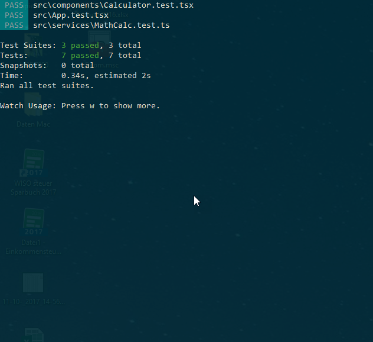
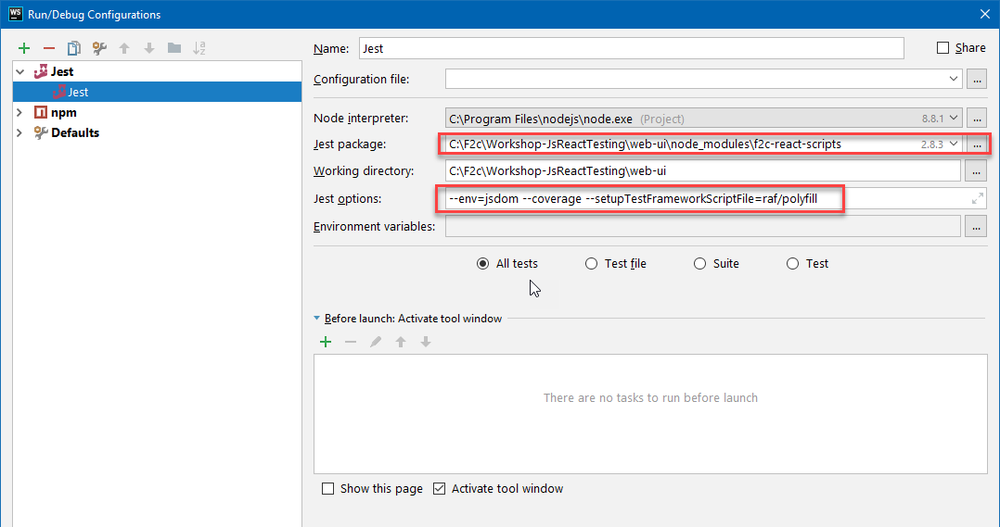
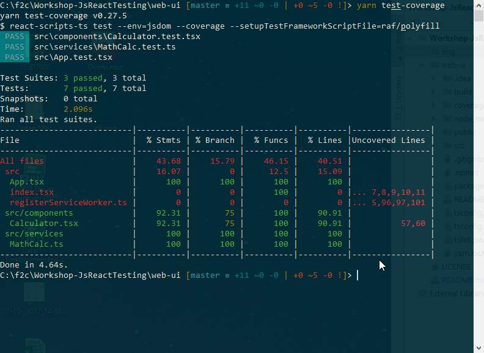

# Workshop-JsReactTesting
Workshop docs for testing with JavaScript, Jest and React using TypeScript 

## Libs
### Facebook Jest 
Link: https://facebook.github.io/jest/

Jest is used by Facebook to test all JavaScript code including React applications. One of Jest's philosophies is to provide an integrated "zero-configuration" experience. We observed that when engineers are provided with ready-to-use tools, they end up writing more tests, which in turn results in more stable and healthy code bases.

Main Features:
- Testrunner
- Code Coverage
- Mocking


### AirBnB Enzyme
Link: http://airbnb.io/enzyme/

Enzyme is a JavaScript Testing utility for React that makes it easier to assert, manipulate, and traverse your React Components' output.

Enzyme's API is meant to be intuitive and flexible by mimicking jQuery's API for DOM manipulation and traversal.

Main Features:
- Asserts for React-Based-Components

Cheatsheet:
https://devhints.io/enzyme

## Getting started
### Write a simple test 

See: Calculator.tests.ts

```
describe('Calculator', () => {
  it('1+1 should return 2', () => {
    let sut = new Calculator();
    let result = sut.add(1, 1);
    expect(result).toBe(2);
  });
});
```

### Run test
#### CLI
```
yarn test
```


####  Webstorm


### Check code coverage
#### Configuration
Enable code coverage option in your test script (package.json):

````
  "scripts": {
    "test-coverage": "react-scripts-ts test --env=jsdom --coverage" ,
                                               ^^^^^^^^^^
  }
````

#### Run 
```
yarn test-coverage
```



### Write a simple test for react components 
#### Add following packages:
```
yarn add --dev enzyme @types/enzyme
yarn add --dev enzyme-adapter-react-16 @types/enzyme-adapter-react-16
```

#### Write your first test:
```
describe('<Calucaltor />', () => {
  beforeAll(() => {
    configure({adapter: new ReactSixteenAdapter()});
  });

  it('renders without crashing', () => {
    const sut = shallow(<Calculator/>);
                ^^^^^^^^^^^^^^^^^^^^^^^
    expect(sut).not.toBeNull();
  });
});
```

#### Query render result:
```
it('should render value1, value2 and a button', () => {
    const sut = shallow(<Calculator/>);
    expect(sut).not.toBeNull();
    
    const controls = {
      value1: sut.find('[name="value1"]').first(),
                  ^^^^^^^^^^^^^^^^^^^^^^^^^^^^^^^^
      value2: sut.find('[name="value2"]').first(),
      button: sut.find('button').first()
    };
    
    expect(controls.value1.length).toBe(1);
    expect(controls.value2.length).toBe(1);
    expect(controls.button.text()).toBe('Calc');
});
```
Enzyme Selector documentation: http://airbnb.io/enzyme/docs/api/shallow.html

#### Simulate user inputs
```
it('should return correct value if calc was clicked', () => {
    let sut = shallow(<Calculator/>);
    const controls = {
      value1: sut.find('[name="value1"]').first(),
      value2: sut.find('[name="value2"]').first(),
      button: sut.find('button').first()
    };
    Object.keys(controls).forEach(x => expect(controls[x].length).toBe(1));
    
    controls.value1.simulate('change', {target: {name: 'value1', value: 1}});
                    ^^^^^^^^^^^^^^^^^^^^^^^^^^^^^^^^^^^^^^^^^^^^^^^^^^^^^^^^
    controls.value1.simulate('change', {target: {name: 'value2', value: 1}});
    controls.button.simulate('click');
    
    let state: CalculatorState = sut.state();
                                 ^^^^^^^^^^^^
    expect(state.result).toBe(2);
    ^^^^^^^^^^^^^^^^^^^^^^^^^^^^
});
```
#### Rendering modes:
- shallow() => Shallow: Shallow rendering is useful to constrain yourself to testing a component as a unit, and to ensure that your tests aren't indirectly asserting on behavior of child components.
- mount() => Full DOM Rendering: Full DOM rendering is ideal for use cases where you have components that may interact with DOM APIs, or may require the full lifecycle in order to fully test the component (i.e., componentDidMount etc.)
- render() => Static Rendered Markup: enzyme's render function is used to render react components to static HTML and analyze the resulting HTML structure.

#TBC
